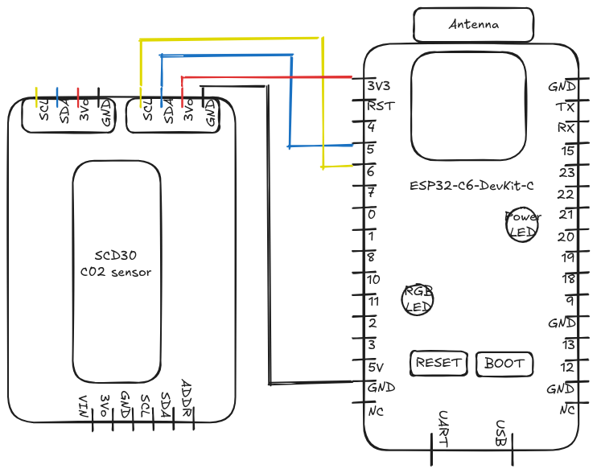

# SCD30_ESP32-C6

Basic reading of SCD30 CO2 sensor on a ESP32-C6 dev board.

## Components

- SCD30 :
    - NDIR technology for accurate CO2 readings from 400 to 10,000 ppm
    - Measure temperature and relative humidity for more accurate measure
    - Local altitude compensation in the setup function for more accurate measure
    - [Link to the manufacturer website](https://sensirion.com/products/catalog/SCD30)
- ESP32-C6-DevKit C1
    - System on a Chip (SoC)
    - [Link to the manufacturer website](https://www.espressif.com/en/products/socs/esp32-c6)


## Electronic diagram



## IDE & Librairies

Developed on Arduino IDE 2.3.6

Librairies required : 
 - for I2C interface : Wire.h
 - for SCD30 : SparkFun_SCD30_Arduino_Library.h


## Example of output

```
08:34:20.720 -> CO2 Concentration: 1011 ppm
08:34:20.720 -> Temperature: 24.8 °C
08:34:20.720 -> Humidity: 49.6 %
```
